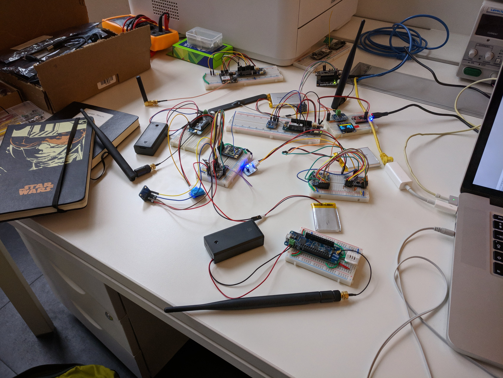
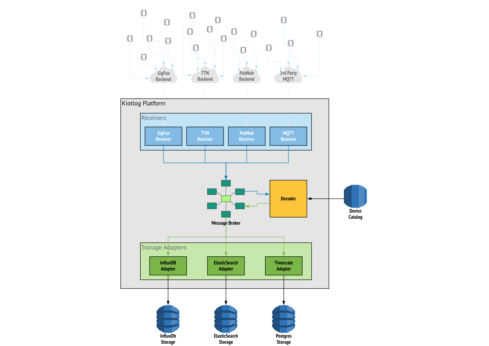

# Kiotlog

### Internet delle Cose Open Source

<!-- #### Una piattaforma per IoT LPWAN -->


**Giampaolo Mancini - Trampoline**
<giampaolo@trampolineup.com> - [@mancho_z](https://twitter.com/mancho_z)

*Sabato 24 Marzo 2018 - MERGE-it*

---

## Chi sono

- Fondatore e CEO, Trampoline (2010)
- Hotspot Wi-Fi Placejam
- Consulenze IoT

---

## Why Kiotlog?

### Agricoltura di Precisione (et al)

- [Officina delle Soluzioni](http://officinasoluzioni.it/), Langhe e Roero
- Cambiamenti climatici
- Necessari rilevamenti ubiquiti
- Stato dell'arte non adatto

---

### Opportunità

- Tecnologie di MCU a basso costo
- Nuove tecnologie di trasmissione
- No software open source

***

### Reti LPWAN

- **L**ow **P**ower
  - 1 Anno con due batterie AA
- **W**ide **A**rea **N**etwork
  - 2Km+

***

- LoRaWAN
  - Modulazione LoRa (proprietaria)
  - Architettura Aperta
- SigFox
  - Servizio commerciale Global
  - Operatori Nazionali
- NB-IoT
  - 5G per reti di sensori

---

## Problemi - 0

- Piattaforme IoT esclusivamente in cloud
- AWS IoT, Azure Iot, GCP IoT, ecc.
- Thingspeak, TheThings, ecc.
- Complesse (Complicate)
- Di chi sono i dati? Dove sono?

---

## Problemi - 1

### Low Bandwidth

- 10 byte/10 minuti
- No [JSON](https://json.org/), no [MsgPack](https://msgpack.org/), no [CBOR](http://cbor.io/)

***

Packed Structs

```arduino
typedef struct __attribute__ ((packed)) payload {
    uint8_t status;
    int16_t dhtTemperature;
    uint16_t dhtHumidity;
    int16_t moduleTemperature;
    uint8_t lastMessageStatus;
} Payload;
```

***

Arduino

```arduino
Payload payload;

void loop() {

  payload.status = client.status;
  payload.dhtTemperature = DHT.temperature * 100;
  payload.dhtHumidity = DHT.temperature * 10;
  payload.moduleTemperature = module.temperature * 100;
  payload.lastMessageStatus = client.response;

  client.write((byte *)&payload, sizeof(Payload));
}
```

***

Array di byte

```arduino
  { 0x01, 0x0f, 0x8c, 0x01, 0xf1,
    0x09, 0x5e, 0x0c, 0x33, 0x00 }
```

***

Ma io volevo

```json
{
  "Stato": true,
  "Temperatura DHT": 23.47,
  "Umidità DHT": 49.1,
  "Temperature M0": 26.23,
  "Risposta": false
}
```


***

Bitfields Structs

```arduino
typedef struct __attribute__ ((packed)) payload_bf {
    uint32_t temperature_internal: 10;
    uint32_t temperature: 10;
    uint32_t pressure: 12;

    uint32_t humidity: 10;
    uint32_t temperature_soil: 10;       
    uint32_t battery_level: 7;
    uint32_t leaf_wetness: 4;
    uint32_t pad0: 1;

    uint32_t rainrate: 8;
    uint32_t pad1: 24;
} PayloadBF;
```

---

## Problemi - 2

### *Rigging* molto diversi

***

 Scrivania alla settimana 2

 <!-- .element height="75%" width="75%" -->

***

#### Connettività

| No IP Addressable     | IP Addressable     |
| --------------------- | ------------------ |
| LoRaWAN               | Cellular           |
| SigFox                | WiFi               |
|                       | nRF24              |

***

#### Sensori e misure

- Rappresentazione vs Precisione vs Range
- Ambientali, specifici, stato dei dispositivi, stato dei sensori

***

- Gestire le combinazioni
  - Protocolli
  - Dispositivi
  - Formati dei payload

---

## Obiettivi

- Catalogo di dispositivi e sensori
- Decodifica dinamica con parsing out-of-band
- Multiprotocollo

---

<!-- _slide: data-background="#ffffff" data-background-image="images/architettura_alpha.svg" data-background-size="cover" data-background-repeat="no-repeat" -->

<!-- .slide: data-background="#ffffff" -->

 <!-- .element: heigth="100%" width="100%" -->

---

## Kiotlog

https://github.com/kiotlog/kiotlog

**GPLv3**

- F# (.Net Core)
- PostgreSQL w/ JSONB
- MQTT (emqtt.io)
- Docker

***

### Stato dell'arte

- Ricevitori SigFox, LoRaWAN, KiotlogSN
- Catalogo e Decoder
- API Web REST
- Dashboard (Grafana)

---

## Ricevitori

- HttpReceiver
  - SigFox Custom Webhooks
  - Generic HTTP Webhooks
  - (The Things Networks Webhooks)

***

- Bridge MQTT
  - Mosquitto
  - The Things Network
  - Generic MQTT

***

- KlsnReceiver
  - Protocolo KiotlogSN
  - MQTT-SN over UDP over 2G/3G/4G/5G
  - Autenticato e Cifrato (ChaCha20Poly1305)

---

## Decoder

- Ricostruisce il frame a partire del catalogo
- ```unpack``` à la [Perl](https://perldoc.perl.org/functions/unpack.html)/[Python](https://docs.python.org/3/library/struct.html)

***

```json
{
    "DeviceID": "18B8D6",
    "Timestamp": 1501691644,
    "Data": "01f5126891991900",
    "Metadata": {
        "RSSI": -80,
        "lat": 45.341,
        "lon": 0.0
        }
}
```

***

Mockup del Catalogo

```json
[
  {
    "device": "18B8D6",
    "frame": { "bigendian": false, "bitfields": false },
    "meta": { "description": "Foo Station", "kind": "Arduino MKRZERO + SIM800H" },
    "sensors" : [
      { "name": "status",   "fmt": {"index": 0, "fmt_chr": "B" }, "sensor_type" : "status" },
      { "name": "temp",     "fmt": {"index": 1, "fmt_chr": "h" }, "sensor_type" : "DHT temperature" },
      { "name": "hum",      "fmt": {"index": 2, "fmt_chr": "H" }, "sensor_type" : "DHT humidity" },
      { "name": "temp_int", "fmt": {"index": 3, "fmt_chr": "h" }, "sensor_type" : "Internal temperature" },
      { "name": "last",     "fmt": {"index": 4, "fmt_chr": "B" }, "sensor_type" : "status" }
    ]
  }
]

```

***

```python
from binascii import unhexilify
from struct import unpack
from json import dumps

fmt_str = catalog.get_fmt_str(device)
# fmt_str = '<BhHhb'

payload = unhexilify(request['Data'])
measures = unpack(fmt_str, payload)
# (0, 23.47, 29.1, 26.23, 0)

labels = catalog.get_measures_names(device)
# ("status", "temp", "hum", "temp_int", "last")

frame = { k: v from k, v in zip(labels, measures)}
# {"status" : 0, "temp": 23.47, "hum": 29.1, "temp_int":26.23, "last": 0}

frame["time"] = request['Timestamp'] 

catalog.save_frame(device, dumps(frame))
```

***

```json
{
  "status": 0,
  "temp": 23.47,
  "hum": 49.1,
  "temp_int": 26.23,
  "last": 0
}
```

---

## Roadmap

- Web UI per Gestione Catalogo - WIP
- Web UI per Dashboard dati (Grafana)
- Supporto multi-tenant e multi-user - WIP
- Validazione dati - WIP
- Autenticazione API - WIP
- Deployment

---

## Demo

- Docker, Docker Compose
- Dashboard
- API

---

### Workshop / Hands-on

## Torino Hacknight 17 Aprile

@Toolbox Torino

---

# Thanks

http://github.com/kiotlog

**Giampaolo Mancini - Trampoline**
<giampaolo@trampolineup.com> - [@mancho_z](https://twitter.com/mancho_z)

